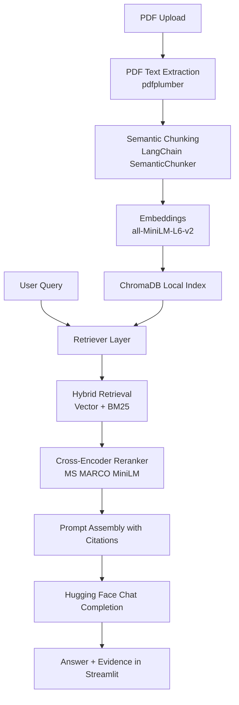

# Document Based Q&A with RAG

[](https://github.com/Sanjeev2004/Document-based-Q-A-using-RAG-project/actions/workflows/ci.yml)


Document Based Q&A is a local Retrieval-Augmented Generation (RAG) system that answers questions from PDFs with source citations, hybrid retrieval, and reranking.

## 1. Project Highlights

- Upload one or many PDFs and index them in local ChromaDB.
- Ask questions from a clean Streamlit UI.
- Hybrid retrieval: vector search + BM25 lexical search.
- Cross-encoder reranking (`ms-marco-MiniLM`) for higher precision.
- Source-aware querying: restrict answers to latest uploaded files only.
- Health checks, auto-repair path for Chroma issues, and CI-backed tests.

## 2. Architecture Diagram

### Mermaid



### Text Flow

```text
PDF(s) -> Extraction -> Semantic Chunks -> Embeddings -> ChromaDB
User Question -> Hybrid Retrieval -> Cross-Encoder Rerank -> LLM -> Cited Answer
```

## 3. Numbered Approach

1. **Collect input documents**
   Store uploaded PDFs temporarily and preserve original filenames as source metadata.
2. **Extract page-level text**
   Parse each page with `pdfplumber`; skip empty pages.
3. **Chunk semantically**
   Use semantic boundaries instead of fixed-size splitting to keep context coherent.
4. **Create embeddings**
   Encode chunks with `sentence-transformers/all-MiniLM-L6-v2`.
5. **Index in ChromaDB**
   Persist vectors locally and de-duplicate by source filename + chunk index.
6. **Retrieve candidates**
   Run both vector retrieval and BM25 retrieval to balance semantic and keyword matching.
7. **Rerank candidates**
   Score retrieved chunks with `cross-encoder/ms-marco-MiniLM-L-6-v2`.
8. **Filter by source scope (optional)**
   Restrict retrieval to latest uploaded files to avoid stale-answer leakage.
9. **Generate answer with citations**
   Build grounded prompt from retrieved chunks and generate via Hugging Face API.
10. **Return answer + evidence**
    Show answer and expandable citation blocks with source, page, and rerank score.

## 4. Project Structure

```text
.
|- app.py
|- health_check.py
|- src/
|  |- config.py
|  |- vectorstore.py
|  |- ingestion.py
|  |- retrieval.py
|  `- generator.py
|- tests/
|  |- test_generator.py
|  |- test_ingestion.py
|  |- test_ingestion_batch.py
|  `- test_retrieval.py
|- .env.example
|- requirements.txt
`- RUN_INSTRUCTIONS.md
```

## 5. Setup

1. Create and activate a virtual environment.
2. Install dependencies.
3. Copy environment template.
4. Add your Hugging Face token.

```bash
python -m venv venv
# Windows
venv\Scripts\activate
# Linux/macOS
source venv/bin/activate

pip install -r requirements.txt

cp .env.example .env
```

Required `.env` key:

```env
HUGGINGFACE_API_KEY=hf_xxx
```

## 6. Run

```bash
python health_check.py
streamlit run app.py
```

Local-only validation:

```bash
python health_check.py --skip-llm
```

## 7. Testing and CI

Run tests locally:

```bash
pytest -q
```

CI workflow:

- File: `.github/workflows/ci.yml`
- Trigger: push and pull request on `main`
- Steps: install deps, run `pytest -q`

## 8. Reliability Features

1. ChromaDB corruption/incompatibility detection.
2. Auto-repair path that moves old DB to timestamped backup.
3. Health-check command for env, Chroma, and model reachability.
4. Runtime cache reset after ingestion to avoid stale retriever state.
5. Replace-index option for hard refresh of knowledge base.

## 9. Recruiter-Focused Value

1. Demonstrates end-to-end LLM system design, not just prompt usage.
2. Shows production-minded patterns: observability, failure handling, and tests.
3. Balances retrieval quality with latency using staged retrieval + reranking.
4. Delivers practical UX controls (latest-source filter, batch ingestion).

## 10. Roadmap

1. Metadata filters (date/type/category) at query time.
2. Conversation memory for multi-turn context.
3. Dockerized one-command local deployment.
4. Benchmark harness for retrieval quality and latency tracking.

## 11. License

Add a `LICENSE` file (MIT recommended) before public portfolio distribution.
